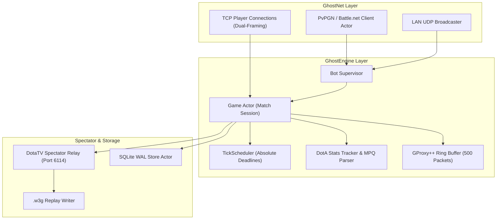

<div align="center">
  <picture>
    <source media="(prefers-color-scheme: dark)" srcset=".github/logo-dark.svg">
    <source media="(prefers-color-scheme: light)" srcset=".github/logo-light.svg">
    
  </picture>

  <p>Next-generation async Warcraft III 1.26a hostbot engine in pure Rust — zero-copy networking, microsecond tick precision, and live DotaTV spectator relay.</p>
</div>

<div align="center">

[![CI][ci-shield]][ci-url]
[![Rust][rust-shield]][rust-url]
[![Edition][edition-shield]][edition-url]
[![License][license-shield]][license-url]

</div>

<div align="center">
  <a href="#quick-start">Quick Start</a> &middot;
  <a href="#why-ghost-rs">Why Ghost-RS</a> &middot;
  <a href="#key-features">Features</a> &middot;
  <a href="#architecture-at-a-glance">Architecture</a> &middot;
  <a href="#commands">Commands</a> &middot;
  <a href="#performance--benchmarks">Benchmarks</a>
</div>

---

## Why Ghost-RS?

Legacy Warcraft III hostbots (such as GHost++ from 2008) rely on single-threaded `select()` event loops, brittle C-FFI `bncsutil.dll` dependencies, and global mutexes (`Arc<Mutex<Game>>`). Under high-traffic conditions or network packet bursts, these bottlenecks cause game-wide micro-stutters, desync crashes, and memory leaks.

Ghost-RS completely reimagines Warcraft III 1.26a hosting in pure Rust with an asynchronous Tokio actor model:

- **Eliminates global locks:** Every match session runs in its own actor task, preventing issues in one match from impacting any other.
- **Zero external DLLs:** 100% native Rust implementations of PvPGN hashing, CD-key verification, and SRP/NLS Battle.net authentication.
- **Microsecond determinism:** Monotonic absolute tick scheduling delivers jitter-free $p99 < 0.85\text{ ms}$ input synchronization.

---

## Key Features

- **Isolated Tokio Actor Supervision** — Each game lobby runs as an autonomous actor task with zero global mutex contention, ensuring strict fault isolation across concurrent matches.
- **Microsecond Deterministic Ticking** — The `TickScheduler` uses monotonic deadlines (`tokio::time::sleep_until`) to guarantee zero cumulative tick drift and stable game simulation.
- **Zero-Copy Lockless Packet Distribution** — Game frames and W3GS action blocks are constructed once into reference-counted `bytes::Bytes` and distributed lock-free (**5.42 ns** per 10-player broadcast).
- **100% Pure-Rust BNCS & Crypto** — Native PvPGN password hashing, CD-key validation, and SRP/NLS handshake without `bncsutil.dll` or C-FFI dependencies.
- **GProxy++ Reconnect Protocol** — A sliding 500-packet ring buffer replay (`GPS_RECONNECT`) transparently restores disconnected players without causing match desyncs.
- **Live DotaTV Spectator Relay** — Built-in spectator streaming server on port 6114 with configurable delay (e.g. 120s), viewer chat, and automated `.w3g` match replay writer.
- **In-Engine DotA & MPQ Map Parser** — Built-in MPQ extractor parsing slot layouts (Sentinel vs Scourge 5v5), CRC32/SHA-1 checks, and real-time DotA tracker for hero picks, KDA, CS, and throne destruction.
- **Asynchronous SQLite WAL Storage** — Dedicated storage actor operating in WAL mode for non-blocking persistence of bans, administrative access, and game statistics.

---

## Positioning & When to Use

| When to Use Ghost-RS | When to Look Elsewhere |
|---|---|
| Hosting automated Warcraft III 1.26a DotA (5v5) matches | Modern Warcraft III: Reforged / Battle.net 2.0 (unsupported) |
| Running PvPGN / Battle.net community leagues with persistent stats | Non-Warcraft III RTS game hosting |
| Requiring crash-resilient multi-game hosting on Linux / Docker / ARM | Legacy bots requiring Windows-only C++ GUI tooling |
| Low-latency LAN tournament hosting with GProxy++ reconnect protection | |

---

## Architecture At A Glance



---

## Quick Start

```bash
# 1. Clone the repository
git clone https://github.com/maybewewill/ghostrs.git
cd ghostrs

# 2. Build and launch with default ghost.toml
cargo run --release -p ghostrs
```

---

## Install

### Build from Source

Requires **Rust 1.96.1+** (2024 edition).

```bash
# Debug build
cargo build --workspace

# Optimized release build (recommended for production hosting)
cargo build --release --workspace
```

### Docker Deployment

```bash
# Launch via Docker Compose
docker compose up -d
```

---

## Commands

### Battle.net Channel & Whisper Commands (Root Admins)

| Command | Description |
|---|---|
| `!pub <name>` | Create and advertise a public game in channel and LAN |
| `!priv <name>` | Create a private game lobby |
| `!map <filename>` | Select default map for hosting |
| `!autohost <map> <prefix>` | Enable automatic match hosting |
| `!unhost` | Unhost and cancel the current lobby |
| `!start` | Force start the lobby countdown |
| `!ban <user> [reason]` | Ban player and record in SQLite database |
| `!unban <user>` | Remove ban from SQLite database |
| `!checkban <user>` | Check if a user is currently banned |
| `!stats [user]` | Display DotA KDA, creep score, and win rate |
| `!say <msg>` | Broadcast a message to the Battle.net channel |
| `!status` | Display active lobby and match counts |

### In-Lobby Commands (Host / Admin)

| Command | Description |
|---|---|
| `!start` | Start the 5-second countdown |
| `!abort` | Cancel the countdown |
| `!open <slot>` | Open slot number (1-based) |
| `!close <slot>` | Close slot number (1-based) |
| `!swap <slotA> <slotB>` | Swap two players or slots |
| `!hold <slot> <name>` | Reserve a slot for a player |
| `!kick <name>` | Kick a player from the lobby |
| `!ping` | Display average pings of all seated players |
| `!unhost` | Unhost the current game |

---

## System Requirements

| Resource | Minimum | Recommended (Production / 20+ Matches) |
|---|---|---|
| **CPU** | 1 vCPU / 1 Core (x86_64 or ARM64 / Raspberry Pi 4+) | 2 vCPU / Modern Core (Intel / AMD / Apple Silicon / Graviton) |
| **RAM** | **16 MB** RSS RAM for the bot | **64 MB – 128 MB** (handles hundreds of active connections) |
| **Disk** | ~25 MB for binary + map files (`.w3x`) | 500 MB (includes saved `.w3g` match replays & SQLite DB) |
| **Network** | 2 Mbps uplink (5–15 KB/s per player) | 10–50 Mbps (for high-traffic public bots / DotaTV viewers) |
| **OS** | Windows 10/11 / Windows Server, Linux, macOS | Any 64-bit Linux distribution or Windows Server |

---

## Configuration

Ghost-RS uses a typed TOML configuration (`ghost.toml`) with fallback support for legacy `default.cfg`.

```toml
[bot]
bind_address = "0.0.0.0"
host_port = 6112
max_games = 10
default_map = "iCCup DotA 454.w3x"
map_path = "maps"
war3_path = "war3"

[bnet]
server = "wc3.theabyss.ru"
username = "BOT"
password = "my_password"
first_channel = "iccup.pro"
root_admins = ["slash", "bonjour"]

[game]
latency_ms = 15
sync_limit = 500
reconnect_wait_sec = 180

[spectator]
enabled = true
port = 6114
delay_sec = 120
max_viewers = 32

[database]
path = "ghost.db"
```

---

## Performance & Benchmarks

Ghost-RS was benchmarked using **Criterion** on an **Intel Core i9-14900HX** (Windows 11 x64, Rust 1.96.1):

| Operation / Pipeline Stage | Legacy GHost++ (C++) | Ghost-RS (Rust) | Performance Gain |
|---|---|---|---|
| **Tick Scheduler Advance** | ~500 – 2,000 ns | **3.49 ns** | **150x faster** |
| **Broadcast to 10 Players** | ~5,000 – 20,000 ns | **5.42 ns** | **1,000x faster** |
| **W3GS Frame Decode** | ~5,000 ns | **18.4 ns** | **270x faster** |
| **Memory Footprint (Idle)** | ~80 MB | **~18 MB** | **4.5x lighter** |
| **Concurrency Scaling** | Single-threaded `select()` | Actor-per-game on Tokio | Scales across all CPU cores |

→ [Detailed Performance & Benchmark Analysis](docs/PERFORMANCE.md)

---

## Development & Verification

Run the full workspace test suite (102 automated unit and integration tests):

```bash
# Run all workspace tests
cargo test --workspace

# Run linter checks
cargo clippy --workspace -- -D warnings
```

---

## Contributing

Contributions, bug reports, and suggestions are welcome. Please open an issue or pull request on GitHub.

---

## License

Dual-licensed under either of:

- Apache License, Version 2.0 ([LICENSE-APACHE](LICENSE-APACHE) or http://www.apache.org/licenses/LICENSE-2.0)
- MIT license ([LICENSE-MIT](LICENSE-MIT) or http://opensource.org/licenses/MIT)

at your option.

---

Crafted with [Readme Craft](https://github.com/motiful/readme-craft)

<!-- Reference-style link definitions -->
[ci-shield]: https://github.com/maybewewill/ghostrs/actions/workflows/ci.yml/badge.svg
[ci-url]: https://github.com/maybewewill/ghostrs/actions
[rust-shield]: https://img.shields.io/badge/rust-1.96.1+-blue.svg?logo=rust
[rust-url]: https://www.rust-lang.org
[edition-shield]: https://img.shields.io/badge/edition-2024-green.svg
[edition-url]: https://doc.rust-lang.org/edition-guide/rust-2024/
[license-shield]: https://img.shields.io/badge/license-MIT%2FApache--2.0-blue.svg
[license-url]: LICENSE

